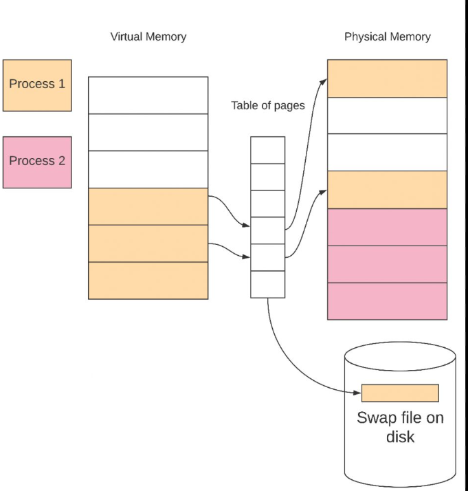

# **Mapping Virtual Memory to Physical Memory**

---

1. **Address Translation**:

   - Virtual addresses must be mapped to physical addresses.
   - CPU works with virtual addresses, auto-translated to physical addresses by MMU and memory controller hardware.

2. **Purpose of Mapping**:
   - Virtual addresses lack content until mapped to a real underlying physical address.
   - Mapping is essential for accessing memory contents.

---

3. **Memory Mapping Process**:

   - Involves setting up a page table.
   - Establishing page table entries for virtual-to-physical address mapping.
   - MMU interprets these entries for memory access.

4. **Accessing Mapped Memory**:
   - Accessing memory means dereferencing a pointer at a virtual address.
   - A virtual address must be mapped in the currently-active page table.

---

---

5. **Handling Unmapped Addresses**:

   - Accessing an unmapped virtual address results in a page fault.
   - OS page fault handler attempts to set up a page table entry.

6. **Core Mapping Functions**:
   - `map_allocated_pages()`: Maps AllocatedPages to frames allocated on demand.
   - Useful for general purposes when specific physical addresses don't matter.
   - `map_allocated_pages_to()`: Maps AllocatedPages to specific AllocatedFrames range. - Useful for accessing hardware devices or memory at a specific physical address.
